# Product Requirements Document (PRD)

## Project Information

**Project Name**

> EcoCycle

**Version**

> v1.0.0

**Status**

* Draft
* In Review
* Approved
* In Development
* Released

**Owner**

> Farid dan Hada

**Last Updated**

> YYYY-MM-DD

---

# 1. Executive Summary

ECOCYCLE merupakan platform digital bank sampah yang dirancang untuk mempermudah masyarakat dalam melakukan penyetoran dan pengelolaan sampah secara lebih praktis, terstruktur, dan terintegrasi. Website ECOCYCLE berperan sebagai media penghubung antara pengguna yang menyetorkan sampah dengan sistem pengelolaan ECOCYCLE, mulai dari pencatatan setoran, informasi sampah, hingga pemberian reward kepada pengguna.

Pada sisi pelanggan, website ECOCYCLE menyediakan akses bagi pengguna untuk melakukan proses penyetoran sampah secara digital. Pengguna dapat memasukkan informasi mengenai jenis dan estimasi jumlah sampah yang akan disetorkan melalui Website ECOCYCLE, sehingga proses yang sebelumnya dilakukan secara manual dapat menjadi lebih mudah dan terdokumentasi. Data setoran tersebut selanjutnya dapat digunakan oleh sistem untuk membantu proses pencatatan dan perhitungan reward atau poin pengguna.

Salah satu fitur utama ECOCYCLE adalah Smart Reward System (Website ECOCYCLE). Sistem ini memberikan poin atau reward kepada pengguna berdasarkan setoran sampah yang dilakukan sesuai dengan ketentuan yang ditetapkan ECOCYCLE. Dengan adanya sistem reward, pengguna tidak hanya terdorong untuk mengelola sampah dengan lebih baik, tetapi juga memperoleh manfaat tambahan dari kontribusi mereka terhadap lingkungan.

Website ECOCYCLE juga mendukung transparansi melalui pencatatan data setoran dan riwayat transaksi pengguna. Selain itu, platform dapat dikembangkan sebagai media edukasi yang memberikan informasi mengenai pemilahan sampah, proses daur ulang, serta manfaat ekonomi dan lingkungan dari pengelolaan sampah.

Secara keseluruhan, Website ECOCYCLE menjadi bagian dari ekosistem Waste-to-Value yang menghubungkan proses Collect → Sort → Track → Reward → Recycle → Sell. Melalui integrasi teknologi, ECOCYCLE tidak hanya berfungsi sebagai tempat pengumpulan sampah, tetapi juga sebagai sistem digital yang mendorong masyarakat untuk mengubah sampah menjadi nilai ekonomi sekaligus memberikan dampak positif terhadap lingkungan.

---

# 2. Problem Statement

Masyarakat yang ingin menyalurkan sampah anorganik bernilai jual membutuhkan informasi yang jelas mengenai lokasi bank sampah, jenis sampah yang diterima, harga, dan prosedur penyetoran. Ketika informasi tersebut sulit diakses atau tersebar di berbagai saluran, masyarakat harus meluangkan waktu tambahan untuk mencari informasi dan menghubungi pengelola. Hambatan ini dapat mengurangi partisipasi dalam pemilahan dan penyetoran sampah, sehingga sampah yang masih memiliki nilai ekonomi berpotensi terbuang bersama sampah rumah tangga lainnya.

Di sisi pengelola, pencatatan setoran, saldo nasabah, dan riwayat transaksi yang dilakukan secara manual atau melalui media terpisah berisiko menimbulkan kesalahan pencatatan serta memperlambat pelayanan dan penyusunan laporan. Nasabah juga mengalami kesulitan memantau hasil penyetoran mereka secara transparan.

Masalah utama yang ingin diselesaikan EcoCycle adalah kesulitan masyarakat dalam mengakses dan menggunakan layanan bank sampah, serta kesulitan pengelola dalam menjaga pencatatan transaksi yang akurat dan mudah dipantau. Penyelesaian masalah ini diharapkan dapat mempermudah penyetoran sampah, meningkatkan transparansi transaksi, dan mendukung partisipasi masyarakat secara berkelanjutan.

# 3. Goals

EcoCycle bertujuan mempermudah masyarakat dalam menggunakan layanan bank sampah serta membantu pengelola menjalankan operasional secara lebih efisien dan transparan. Tujuan produk meliputi:

1. **Mempermudah akses informasi layanan bank sampah**  
    Membantu masyarakat menemukan informasi lokasi, jenis sampah yang diterima, harga, dan prosedur penyetoran dengan mudah.
    
2. **Mempermudah proses penyetoran sampah**  
    Mengurangi hambatan yang dihadapi masyarakat saat menyalurkan sampah bernilai jual kepada bank sampah.
    
3. **Meningkatkan akurasi dan efisiensi pencatatan**  
    Membantu pengelola mencatat setoran, saldo nasabah, dan riwayat transaksi secara terpusat untuk mengurangi kesalahan serta mempercepat pelayanan dan penyusunan laporan.
    
4. **Meningkatkan transparansi transaksi**  
    Memudahkan nasabah memantau riwayat setoran dan saldo, sehingga hasil pengelolaan sampah mereka dapat diketahui dengan jelas.
    
5. **Mendorong partisipasi masyarakat secara berkelanjutan**  
    Mendorong masyarakat untuk rutin memilah dan menyetorkan sampah melalui layanan yang mudah digunakan serta manfaat ekonomi yang dapat dipantau.

---

# 4. Non-Goals

Pada tahap awal pengembangan, EcoCycle tidak ditujukan untuk:

1. **Mengelola seluruh jenis sampah**  
    Layanan difokuskan pada sampah anorganik bernilai jual yang diterima oleh bank sampah mitra. Pengelolaan sampah organik, medis, dan limbah berbahaya berada di luar cakupan.
    
2. **Melakukan pengolahan atau daur ulang secara langsung**  
    EcoCycle mendukung akses layanan dan administrasi bank sampah. Pengolahan fisik sampah tetap menjadi tanggung jawab bank sampah dan mitra daur ulang.
    
3. **Menyediakan layanan pengangkutan sampah umum**  
    EcoCycle tidak menggantikan layanan kebersihan atau pengangkutan sampah rumah tangga yang disediakan oleh pemerintah maupun penyedia jasa lainnya.
    
4. **Menjadi marketplace produk daur ulang**  
    Penjualan dan pembelian produk hasil daur ulang tidak termasuk dalam cakupan awal produk.
    
5. **Menyediakan layanan keuangan di luar transaksi bank sampah**  
    Saldo nasabah hanya digunakan untuk mencatat nilai setoran dan penarikan hasil penjualan sampah. Produk tidak menyediakan pinjaman, investasi, atau layanan perbankan umum.
    
6. **Menjangkau seluruh wilayah pada peluncuran awal**  
    Implementasi awal dibatasi pada wilayah dan bank sampah mitra yang telah ditentukan untuk memvalidasi kebutuhan pengguna serta kesiapan operasional.

---

# 5. Target Users

## Primary Users
- Masyarakat

## Secondary Users

Contoh:

* Perpustakaan
* Administrator

---

# 6. User Personas

## Persona 1: Nasabah Bank Sampah

**Nama**

- Rina, 35 tahun.
    

**Latar belakang**

- Ibu rumah tangga yang tinggal di wilayah layanan bank sampah mitra.
    
- Menghasilkan sampah rumah tangga seperti botol plastik, kardus, dan kaleng.
    
- Ingin menjaga kebersihan lingkungan sekaligus memperoleh tambahan penghasilan.
    
- Terbiasa menggunakan WhatsApp, tetapi belum terbiasa dengan aplikasi bank sampah.
    

**Goals**

- Menemukan bank sampah terdekat dan mengetahui jadwal operasionalnya.
    
- Mengetahui jenis sampah yang diterima serta harga per kilogram.
    
- Menyetorkan sampah dengan prosedur yang mudah dipahami.
    
- Memantau saldo dan riwayat setoran secara mandiri.
    

**Pain points**

- Informasi layanan bank sampah sulit ditemukan.
    
- Harus menghubungi petugas untuk menanyakan harga dan jadwal.
    
- Belum memahami cara memilah sampah sesuai ketentuan.
    
- Kesulitan memantau saldo jika hanya mengandalkan catatan fisik.
    

## Persona 2: Pengelola Bank Sampah

**Nama**

- Budi, 42 tahun.
    

**Latar belakang**

- Pengelola bank sampah tingkat lingkungan yang melayani warga sekitar.
    
- Bertanggung jawab atas penimbangan, pencatatan setoran, saldo nasabah, dan laporan.
    
- Menggunakan buku catatan serta spreadsheet untuk administrasi.
    
- Memiliki keterbatasan waktu dan jumlah petugas.
    

**Goals**

- Mencatat setoran sampah dengan cepat dan akurat.
    
- Mengelola data nasabah, harga sampah, dan saldo dalam satu tempat.
    
- Menyediakan informasi transaksi yang jelas kepada nasabah.
    
- Menyusun laporan tanpa merekap ulang seluruh catatan.
    

**Pain points**

- Pencatatan manual rentan terhadap kesalahan hitung dan kehilangan data.
    
- Data yang tersebar menyulitkan pencarian riwayat transaksi.
    
- Rekap laporan membutuhkan waktu yang cukup lama.
    
- Pertanyaan berulang mengenai saldo, harga, dan jadwal menambah beban pelayanan.
---

# 7. User Stories

**Nasabah Bank Sampah**

- Sebagai nasabah, saya ingin mencari bank sampah terdekat, sehingga saya dapat memilih lokasi penyetoran yang mudah dijangkau.
    
- Sebagai nasabah, saya ingin melihat jadwal operasional bank sampah, sehingga saya dapat merencanakan waktu penyetoran.
    
- Sebagai nasabah, saya ingin mengetahui jenis sampah yang diterima dan harga per kilogram, sehingga saya dapat menyiapkan sampah serta memperkirakan nilai setoran.
    
- Sebagai nasabah, saya ingin melihat panduan pemilahan dan prosedur penyetoran, sehingga saya dapat menyetorkan sampah sesuai ketentuan.
    
- Sebagai nasabah, saya ingin melihat saldo dan riwayat transaksi, sehingga saya dapat memantau hasil setoran serta penarikan saya.
    

**Pengelola Bank Sampah**

- Sebagai pengelola, saya ingin mengelola data nasabah, sehingga setiap transaksi tercatat atas nama nasabah yang benar.
    
- Sebagai pengelola, saya ingin memperbarui jenis sampah yang diterima dan harga per kilogram, sehingga nasabah memperoleh informasi yang sesuai dengan ketentuan terbaru.
    
- Sebagai pengelola, saya ingin mencatat jenis dan berat sampah yang disetorkan, sehingga nilai setoran dapat dihitung otomatis berdasarkan harga yang berlaku.
    
- Sebagai pengelola, saya ingin saldo nasabah diperbarui setelah transaksi setoran tercatat, sehingga saldo sesuai dengan hasil transaksi.
    
- Sebagai pengelola, saya ingin mencatat penarikan saldo nasabah, sehingga saldo dan riwayat transaksi tetap akurat.
    
- Sebagai pengelola, saya ingin memperbarui lokasi, jadwal operasional, dan prosedur penyetoran, sehingga nasabah dapat merencanakan kunjungan.
    
- Sebagai pengelola, saya ingin melihat dan mengekspor laporan transaksi berdasarkan periode, sehingga saya dapat mengevaluasi kegiatan serta menyusun laporan operasional.
# 8. Functional Requirements

## Authentication

### Login

**Description**

Nasabah dan pengelola dapat masuk menggunakan email dan kata sandi untuk mengakses fitur sesuai perannya.

**Acceptance Criteria**

- Pengguna dapat memasukkan email dan kata sandi.
    
- Jika data valid, pengguna diarahkan ke dashboard sesuai perannya.
    
- Jika data tidak valid, sistem menampilkan pesan kesalahan.
    
- Kolom wajib yang kosong menampilkan pesan validasi.
    
- Pengguna yang belum login tidak dapat mengakses saldo, transaksi, atau halaman pengelolaan.
    
- Pengguna dapat logout untuk mengakhiri sesi.
    

**Priority:** Must Have.

---

### Register

**Description**

Calon nasabah dapat membuat akun EcoCycle. Akun pengelola dibuat oleh administrator untuk membatasi akses pengelolaan.

**Acceptance Criteria**

- Calon nasabah dapat mengisi nama, email, nomor telepon, kata sandi, dan konfirmasi kata sandi.
    
- Sistem memvalidasi kelengkapan data dan format email.
    
- Email yang sudah terdaftar tidak dapat digunakan kembali.
    
- Kata sandi dan konfirmasi kata sandi harus sama.
    
- Pendaftaran berhasil membuat akun dengan peran nasabah dan saldo awal Rp0.
    
- Pengguna tidak dapat memilih peran pengelola melalui pendaftaran umum.
    
- Setelah pendaftaran berhasil, pengguna diarahkan ke halaman login.
    

**Priority:** Must Have.

---

## Feature 2: Informasi Bank Sampah

**Description**

Pengguna dapat mencari dan melihat informasi bank sampah mitra sebelum melakukan penyetoran.

**Acceptance Criteria**

- Pengguna dapat melihat daftar bank sampah mitra.
    
- Pengguna dapat mencari bank sampah berdasarkan nama atau wilayah.
    
- Detail bank sampah menampilkan alamat, kontak, jadwal operasional, dan prosedur penyetoran.
    
- Pengguna dapat melihat jenis sampah yang diterima beserta harga per kilogram.
    
- Sistem menampilkan pesan jika pencarian tidak menghasilkan data.
    
- Informasi yang diperbarui pengelola tampil pada halaman bank sampah terkait.
    

**Priority:** Must Have.

---

## Feature 3: Panduan Pemilahan Sampah

**Description**

Pengguna dapat membaca panduan untuk menyiapkan sampah sesuai ketentuan bank sampah.

**Acceptance Criteria**

- Pengguna dapat melihat panduan berdasarkan jenis sampah.
    
- Panduan menjelaskan contoh sampah dan cara menyiapkannya sebelum disetorkan.
    
- Panduan dapat diakses tanpa login.
    

**Priority:** Should Have.

---

## Feature 4: Pengelolaan Data Nasabah

**Description**

Pengelola dapat melihat dan memperbarui data nasabah yang terhubung dengan bank sampahnya.

**Acceptance Criteria**

- Pengelola dapat mencari nasabah berdasarkan nama atau ID nasabah.
    
- Pengelola dapat melihat profil, saldo, dan riwayat transaksi nasabah.
    
- Pengelola dapat memperbarui data kontak nasabah.
    
- Pengelola hanya dapat mengakses data nasabah bank sampah yang dikelolanya.
    
- Perubahan profil tidak mengubah saldo atau riwayat transaksi.
    

**Priority:** Must Have.

---

## Feature 5: Pengelolaan Jenis dan Harga Sampah

**Description**

Pengelola dapat mengatur jenis sampah yang diterima dan harga per kilogram.

**Acceptance Criteria**

- Pengelola dapat menambah jenis sampah, mengubah harga, dan menonaktifkan jenis sampah.
    
- Harga wajib berupa angka positif.
    
- Jenis sampah yang dinonaktifkan tidak dapat dipilih untuk setoran baru.
    
- Perubahan harga hanya berlaku untuk transaksi baru.
    
- Transaksi sebelumnya tetap menyimpan harga yang digunakan saat penyetoran.
    

**Priority:** Must Have.

---

## Feature 6: Pencatatan Setoran Sampah

**Description**

Pengelola dapat mencatat setoran nasabah dan menghitung nilai setoran secara otomatis.

**Acceptance Criteria**

- Pengelola dapat memilih nasabah serta memasukkan jenis dan berat sampah dalam kilogram.
    
- Satu transaksi dapat memuat lebih dari satu jenis sampah.
    
- Berat sampah wajib berupa angka positif dan dapat menggunakan nilai desimal.
    
- Sistem menghitung nilai setiap jenis sampah dengan rumus berat × harga per kilogram.
    
- Sistem menjumlahkan seluruh nilai menjadi total setoran.
    
- Pengelola dapat memeriksa rincian sebelum mengonfirmasi transaksi.
    
- Setelah dikonfirmasi, transaksi tersimpan dan saldo nasabah bertambah sebesar total setoran.
    
- Pengiriman ulang transaksi yang sama tidak menghasilkan pencatatan atau penambahan saldo ganda.
    

**Priority:** Must Have.

---

## Feature 7: Saldo dan Riwayat Transaksi

**Description**

Nasabah dapat memantau saldo serta riwayat setoran dan penarikan miliknya.

**Acceptance Criteria**

- Nasabah dapat melihat saldo terkini.
    
- Riwayat menampilkan tanggal, jenis transaksi, nominal, dan bank sampah terkait.
    
- Detail setoran menampilkan jenis sampah, berat, harga saat transaksi, dan total nilai.
    
- Nasabah dapat memfilter riwayat berdasarkan periode.
    
- Nasabah hanya dapat mengakses saldo dan transaksi miliknya.
    
- Sistem menampilkan pesan jika belum ada transaksi.
    

**Priority:** Must Have.

---

## Feature 8: Pencatatan Penarikan Saldo

**Description**

Pengelola dapat mencatat penarikan setelah pembayaran kepada nasabah dilakukan di luar sistem.

**Acceptance Criteria**

- Pengelola dapat memilih nasabah dan memasukkan nominal penarikan.
    
- Nominal wajib lebih dari Rp0 dan tidak melebihi saldo nasabah.
    
- Pengelola harus mengonfirmasi bahwa pembayaran telah dilakukan sebelum menyimpan transaksi.
    
- Setelah dikonfirmasi, saldo berkurang sesuai nominal penarikan.
    
- Transaksi penarikan tampil dalam riwayat nasabah.
    
- Pengiriman ulang transaksi yang sama tidak mengurangi saldo dua kali.
    

**Priority:** Must Have.

---

## Feature 9: Pengelolaan Informasi Bank Sampah

**Description**

Pengelola dapat memperbarui informasi layanan bank sampahnya.

**Acceptance Criteria**

- Pengelola dapat mengubah alamat, kontak, jadwal operasional, dan prosedur penyetoran.
    
- Sistem memvalidasi kelengkapan kolom wajib sebelum menyimpan perubahan.
    
- Perubahan yang berhasil disimpan tampil pada halaman informasi bank sampah.
    
- Pengelola hanya dapat mengubah informasi bank sampah yang dikelolanya.
    

**Priority:** Must Have.

---

## Feature 10: Laporan Operasional

**Description**

Pengelola dapat melihat ringkasan kegiatan bank sampah dan mengekspor laporan berdasarkan periode.

**Acceptance Criteria**

- Pengelola dapat memilih tanggal awal dan akhir laporan.
    
- Laporan menampilkan jumlah transaksi setoran, total berat sampah per jenis, total nilai setoran, dan total penarikan.
    
- Data laporan sesuai dengan transaksi pada periode yang dipilih.
    
- Pengelola dapat mengekspor laporan dalam format CSV.
    
- Sistem menampilkan pesan jika tidak ada transaksi pada periode tersebut.
    
- Pengelola hanya dapat mengakses laporan bank sampah yang dikelolanya.
    

**Priority:** Should Have.

---

---

# 9. Non-Functional Requirements

## Performance

- Waktu respons API untuk operasi umum kurang dari 500 ms pada persentil ke-95, dengan beban uji 50 pengguna aktif bersamaan.
    
- Halaman utama dan dashboard dapat digunakan dalam waktu kurang dari 3 detik pada koneksi internet stabil.
    
- Pencarian bank sampah dan riwayat transaksi memberikan hasil dalam waktu kurang dari 2 detik.
    
- Daftar nasabah dan transaksi menggunakan pagination untuk membatasi jumlah data yang dimuat.
    

## Security

- Autentikasi menggunakan JWT dengan masa berlaku terbatas dan validasi token pada setiap akses ke API yang dilindungi.
    
- Kata sandi disimpan menggunakan hashing Argon2id atau bcrypt.
    
- Seluruh komunikasi antara pengguna dan server menggunakan HTTPS.
    
- Sistem memvalidasi input di sisi server dan menggunakan query terparameterisasi untuk mencegah SQL injection.
    
- Hak akses dibatasi berdasarkan peran dan kepemilikan data. Nasabah hanya dapat mengakses data miliknya, sedangkan pengelola hanya dapat mengakses bank sampah yang dikelolanya.
    
- Endpoint login menerapkan pembatasan percobaan untuk mengurangi risiko brute-force.
    
- Token, kata sandi, dan data pribadi sensitif tidak dicatat dalam log.
    

## Reliability

- Target ketersediaan layanan minimal 99,5% per bulan, di luar pemeliharaan terjadwal.
    
- Pencatatan transaksi dan perubahan saldo dilakukan dalam satu transaksi database agar keduanya berhasil atau dibatalkan bersama.
    
- Sistem mencegah transaksi ganda akibat pengiriman ulang permintaan.
    
- Kesalahan ditangani dengan pesan yang mudah dipahami tanpa menampilkan detail internal sistem.
    
- Sistem mencatat kesalahan dan aktivitas penting, termasuk pencatatan setoran serta penarikan saldo.
    
- Monitoring mencakup ketersediaan layanan, waktu respons, dan tingkat kesalahan, dengan notifikasi saat terjadi gangguan.
    
- Backup database dilakukan setiap hari. Target kehilangan data maksimal 24 jam dan pemulihan layanan maksimal 4 jam, serta diuji melalui simulasi pemulihan.
    

## Scalability

- Arsitektur dibagi menjadi modul autentikasi, bank sampah, nasabah, transaksi, dan laporan.
    
- API bersifat stateless agar dapat dijalankan pada beberapa instance server.
    
- Database menggunakan indeks pada kolom yang sering digunakan untuk pencarian dan filter, seperti ID nasabah, ID bank sampah, dan tanggal transaksi.
    
- Sistem mendukung penambahan bank sampah mitra tanpa perubahan besar pada struktur aplikasi.
    
- Pembuatan laporan berukuran besar diproses di latar belakang agar tidak menghambat transaksi utama.
    

## Usability

- Antarmuka responsif dan dapat digunakan melalui ponsel maupun desktop.
    
- Label, instruksi, dan pesan kesalahan menggunakan bahasa Indonesia yang jelas.
    
- Formulir menampilkan kesalahan pada kolom terkait tanpa menghapus input yang sudah benar.
    
- Informasi harga, berat, dan saldo menggunakan format serta satuan yang konsisten.
    
- Fungsi utama dapat diakses menggunakan keyboard, dengan kontras teks yang memenuhi WCAG 2.1 tingkat AA.
# 10. User Flow

## Nasabah: Melihat Informasi Bank Sampah

Pengunjung → Cari bank sampah berdasarkan nama atau wilayah → Pilih bank sampah → Lihat lokasi, jadwal, jenis sampah, harga, dan prosedur penyetoran.

## Nasabah: Registrasi dan Login

Pengunjung → Register → Isi data diri → Validasi data → Akun berhasil dibuat → Login → Dashboard nasabah.

Jika sudah memiliki akun, pengguna langsung menuju Login. Jika data tidak valid, sistem menampilkan pesan agar pengguna dapat memperbaikinya.

## Nasabah: Menyetorkan Sampah

Lihat informasi dan panduan pemilahan → Siapkan sampah → Datang ke bank sampah → Petugas menimbang dan mencatat setoran → Petugas mengonfirmasi transaksi → Saldo bertambah → Nasabah melihat rincian setoran.

## Nasabah: Memantau Saldo dan Transaksi

Login → Dashboard nasabah → Lihat saldo → Buka riwayat transaksi → Filter berdasarkan periode → Pilih transaksi → Lihat detail transaksi.

## Nasabah: Menarik Saldo

Datang ke bank sampah → Ajukan penarikan kepada petugas → Petugas memeriksa saldo → Pembayaran dilakukan di luar sistem → Petugas mencatat dan mengonfirmasi penarikan → Saldo berkurang → Riwayat penarikan tersedia.

## Pengelola: Mencatat Setoran

Login → Dashboard pengelola → Cari dan pilih nasabah → Masukkan jenis serta berat sampah → Sistem menghitung nilai setoran → Periksa rincian → Konfirmasi → Transaksi tersimpan dan saldo nasabah bertambah.

## Pengelola: Mengelola Informasi Layanan

Login → Dashboard pengelola → Pilih informasi bank sampah atau jenis dan harga sampah → Ubah data → Validasi → Simpan → Informasi terbaru tampil kepada pengguna.

## Pengelola: Membuat Laporan

Login → Dashboard pengelola → Buka laporan operasional → Pilih periode → Lihat ringkasan → Ekspor laporan CSV.

# 11. Success Metrics

- **API Success Rate ≥ 99%:** persentase permintaan valid yang berhasil diproses, di luar kesalahan input atau autentikasi pengguna.
    
- **Waktu respons API persentil ke-95 < 500 ms:** untuk operasi umum pada beban uji 50 pengguna aktif bersamaan.
    
- **Keberhasilan pencatatan setoran ≥ 95%:** persentase proses pencatatan yang berhasil diselesaikan pengelola dalam pengujian pengguna.
    
- **Konsistensi saldo 100%:** saldo nasabah sesuai dengan saldo awal ditambah total setoran dan dikurangi total penarikan.
    
- **Tidak ada transaksi ganda:** pengiriman ulang permintaan tidak menyebabkan penambahan atau pengurangan saldo berulang.
    
- **Waktu pencatatan setoran berkurang ≥ 30%:** dibandingkan proses sebelumnya, diukur pada transaksi dengan kompleksitas yang setara.
    
- **Kepuasan pengguna ≥ 4/5:** berdasarkan survei nasabah dan pengelola setelah uji coba.
    
- **Ketersediaan layanan ≥ 99,5% per bulan:** di luar pemeliharaan terjadwal.
---

# 12. Technical Constraints

## Backend

- Menggunakan Python dengan framework FastAPI.
    
- Menyediakan REST API untuk autentikasi, informasi bank sampah, nasabah, transaksi, dan laporan.
    
- Validasi input serta pemeriksaan hak akses dilakukan di sisi server.
    
- Pencatatan transaksi dan pembaruan saldo harus dilakukan dalam satu transaksi database.
    
- Perhitungan nilai uang menggunakan tipe Decimal untuk menghindari kesalahan pembulatan.
    

## Frontend

- Menggunakan Next.js dengan TypeScript.
    
- Antarmuka responsif dengan prioritas penggunaan melalui ponsel.
    
- Mendukung browser modern seperti Chrome, Firefox, Safari, dan Edge.
    
- MVP berbentuk aplikasi web dan membutuhkan koneksi internet. Aplikasi mobile native serta penggunaan offline berada di luar cakupan awal.
    

## Database

- Menggunakan MySQL sebagai database relasional.
    
- Menyimpan data pengguna, bank sampah, jenis sampah, harga, setoran, dan penarikan.
    
- Nilai uang disimpan menggunakan tipe NUMERIC.
    
- Setiap transaksi menyimpan harga yang berlaku saat transaksi agar perubahan harga tidak mengubah riwayat.
    
- Relasi dan constraint database digunakan untuk menjaga konsistensi data.
    
- Transaksi keuangan yang sudah dikonfirmasi tidak dihapus secara langsung. Koreksi harus memiliki jejak audit.
    

## Hosting

- Frontend, backend, dan database menggunakan layanan hosting yang mendukung teknologi masing-masing.
    
- Infrastruktur wajib mendukung HTTPS, environment variables, monitoring, dan backup.
    
- Kredensial serta secret disimpan di konfigurasi server dan tidak dimasukkan ke kode sumber atau frontend.
    
- Pemilihan paket hosting disesuaikan dengan anggaran dan target performa MVP.
    
- Lokasi server diutamakan dekat dengan wilayah pengguna untuk mengurangi latensi.
    

## Third-party Services

- Tautan peta eksternal digunakan untuk membantu pengguna membuka lokasi bank sampah.
    
- Layanan email dapat digunakan untuk verifikasi akun dan pemulihan kata sandi jika fitur tersebut masuk cakupan MVP.
    
- Monitoring eksternal digunakan sesuai kebutuhan dan anggaran.
    
- MVP tidak memerlukan payment gateway karena pembayaran penarikan dilakukan di luar sistem.
    
- API key hanya disimpan di server, kecuali key publik yang memang dirancang untuk frontend dan telah dibatasi penggunaannya.
    
- Kegagalan layanan pihak ketiga tidak boleh menghambat pencatatan setoran dan penarikan.
---

# 13. Assumptions

- Bank sampah mitra bersedia menggunakan EcoCycle dan menunjuk petugas untuk mengelola data.
    
- Informasi lokasi, jadwal operasional, jenis sampah, dan harga tersedia dari bank sampah mitra.
    
- Pengguna memiliki perangkat dengan browser modern dan koneksi internet.
    
- Nasabah memiliki alamat email untuk pendaftaran dan login.
    
- Pengelola memiliki kemampuan digital dasar dan dapat mengikuti pelatihan penggunaan aplikasi.
    
- Pemilahan dan penyetoran sampah dilakukan secara langsung di bank sampah.
    
- Bank sampah memiliki alat timbang yang layak digunakan.
    
- Petugas memeriksa jenis dan berat sampah sebelum mengonfirmasi setoran.
    
- Harga sampah ditentukan oleh masing-masing bank sampah dan diperbarui oleh pengelola.
    
- Saldo awal nasabah baru adalah Rp0. Migrasi saldo nasabah lama, jika diperlukan, menggunakan data yang telah diverifikasi.
    
- Pembayaran penarikan saldo dilakukan di luar aplikasi, kemudian dicatat oleh petugas.
    
- Uji coba awal dilakukan pada sejumlah bank sampah mitra dalam wilayah yang telah ditentukan.
    
- Kebutuhan pengguna dan alur operasional yang disusun dalam PRD akan divalidasi bersama nasabah serta pengelola sebelum implementasi.

---

# 14. Risks

| Risk                                                | Impact | Mitigation                                                                                                                    |
| --------------------------------------------------- | ------ | ----------------------------------------------------------------------------------------------------------------------------- |
| Kesalahan pencatatan berat, harga, atau nasabah     | High   | Validasi input dan tampilkan rincian untuk diperiksa sebelum transaksi dikonfirmasi.                                          |
| Saldo tidak konsisten atau transaksi tercatat ganda | High   | Gunakan transaksi database dan pencegahan permintaan ganda; lakukan rekonsiliasi saldo secara berkala.                        |
| Akses tidak sah terhadap data nasabah               | High   | Terapkan pembatasan akses berdasarkan peran dan kepemilikan data, HTTPS, serta hashing kata sandi.                            |
| Kehilangan data transaksi                           | High   | Lakukan backup harian dan uji pemulihan secara berkala.                                                                       |
| Informasi harga atau jadwal tidak diperbarui        | Medium | Tetapkan petugas penanggung jawab dan tampilkan waktu pembaruan informasi.                                                    |
| Koneksi internet atau layanan hosting terganggu     | Medium | Tampilkan status kegagalan dengan jelas dan sediakan prosedur pencatatan sementara yang direkonsiliasi setelah layanan pulih. |
| API lambat saat data bertambah                      | Medium | Gunakan pagination, indeks database, dan optimasi query; terapkan caching untuk informasi publik.                             |
| Pengelola kesulitan menggunakan aplikasi            | Medium | Sediakan antarmuka sederhana, panduan, dan pelatihan singkat sebelum uji coba.                                                |
| Penarikan dicatat sebelum pembayaran dilakukan      | High   | Wajibkan konfirmasi pembayaran oleh petugas dan simpan jejak audit transaksi.                                                 |
| Cakupan pengembangan bertambah                      | High   | Tetapkan batas MVP dan evaluasi permintaan tambahan berdasarkan prioritas, waktu, serta biaya.                                |

---

# 15. Dependencies

## Internal

- Persetujuan cakupan MVP dan alur operasional oleh tim serta bank sampah mitra.
    
- Desain antarmuka untuk nasabah dan pengelola.
    
- Ketersediaan tim pengembangan dan pengujian.
    
- Penetapan aturan harga, pembulatan nilai setoran, penarikan, dan koreksi transaksi.
    
- Kesiapan petugas serta panduan penggunaan aplikasi.
    

## External

- Kerja sama dengan bank sampah mitra untuk pelaksanaan uji coba.
    
- Ketersediaan perangkat, koneksi internet, dan alat timbang di bank sampah.
    
- Ketersediaan layanan hosting, database, dan domain.
    
- Pembaruan informasi layanan serta harga oleh pengelola.
    
- Pelaksanaan pembayaran penarikan oleh bank sampah di luar aplikasi.
    

## Third-party API

- Tidak ada API pihak ketiga yang wajib digunakan untuk fungsi utama MVP.
    
- Lokasi bank sampah dapat dibuka melalui tautan peta eksternal tanpa integrasi API.
    
- Layanan email diperlukan apabila verifikasi email atau pemulihan kata sandi diterapkan.
    
- Gangguan layanan tambahan tidak boleh menghambat pencatatan transaksi utama.
    

## Dataset

- Tidak diperlukan dataset pelatihan AI.
    
- Data awal mencakup profil bank sampah, lokasi, jadwal, jenis sampah, dan harga per kilogram.
    
- Data nasabah dan transaksi diperoleh melalui pendaftaran serta kegiatan operasional.
    
- Jika ada migrasi nasabah lama, data identitas dan saldo awal harus diverifikasi oleh bank sampah.
    
- Data simulasi digunakan untuk pengujian dan dipisahkan dari data operasional.

---

# 16. Milestones

| Milestone     | Target Date | Status  |
| ------------- | ----------- | ------- |
| Project Setup | YYYY-MM-DD  | Planned |
| MVP           | YYYY-MM-DD  | Planned |
| Beta          | YYYY-MM-DD  | Planned |
| Production    | YYYY-MM-DD  | Planned |

---

# 17. Release Plan

Example:

## Version 1.0

Fitur:

* Login
* Register
* Dashboard
* Search
* Recommendation

---

## Version 1.1

Fitur:

* Favorite Books
* Rating
* History

---

# 18. Acceptance Criteria

Produk dianggap siap untuk peluncuran MVP apabila:

- Seluruh fitur **Must Have** selesai dan memenuhi acceptance criteria pada bagian Functional Requirements.
    
- Fitur **Should Have** yang disepakati masuk dalam cakupan peluncuran telah selesai.
    
- Alur utama nasabah dan pengelola berhasil diuji dari awal hingga akhir.
    
- Perhitungan nilai setoran dan saldo akurat, serta pengiriman ulang permintaan tidak menghasilkan transaksi ganda.
    
- Hak akses teruji: nasabah hanya dapat mengakses data miliknya dan pengelola hanya dapat mengakses bank sampah yang dikelolanya.
    
- Tidak ada bug kritis atau berprioritas tinggi yang belum diselesaikan.
    
- Target performa yang ditetapkan tercapai dalam pengujian beban.
    
- Backup dan pemulihan database berhasil diuji.
    
- Website dapat digunakan melalui ponsel dan desktop pada browser yang didukung.
    
- Dokumentasi instalasi, konfigurasi, operasional, dan panduan pengguna tersedia.
    
- Pengujian penerimaan pengguna bersama perwakilan nasabah dan pengelola dinyatakan lulus.
    
- Website telah tersedia di lingkungan produksi dengan HTTPS, logging, dan monitoring aktif.
    

Metrik kepuasan pengguna dan peningkatan efisiensi operasional dievaluasi setelah uji coba, ketika data penggunaan sudah mencukupi.

---

# 19. Open Questions

- Bank sampah mana dan wilayah apa yang akan menjadi lokasi uji coba awal?
    
- Apakah satu akun nasabah dapat digunakan di beberapa bank sampah? Jika iya, apakah saldo dipisahkan per bank sampah?
    
- Apakah pendaftaran cukup menggunakan email, atau perlu mendukung nomor telepon?
    
- Apakah verifikasi email dan pemulihan kata sandi termasuk dalam cakupan MVP?
    
- Siapa yang berwenang membuat akun pengelola dan memberikan hak akses?
    
- Bagaimana aturan pembulatan berat sampah dan nilai uang hasil setoran?
    
- Bagaimana prosedur koreksi transaksi yang sudah dikonfirmasi, dan siapa yang berwenang menyetujuinya?
    
- Apakah penarikan memiliki nominal minimum, batas harian, atau persyaratan tertentu?
    
- Apakah nasabah membutuhkan bukti transaksi yang dapat diunduh atau dicetak?
    
- Apakah data nasabah dan saldo lama perlu dimigrasikan? Siapa yang memverifikasi data tersebut?
    
- Berapa perkiraan jumlah nasabah, bank sampah mitra, dan pengguna aktif bersamaan pada tahap awal?
    
- Berapa anggaran hosting dan siapa yang bertanggung jawab atas pemeliharaan setelah peluncuran?
    
- Berapa lama data nasabah, transaksi, dan log disimpan?
    
- Apakah laporan operasional masuk dalam peluncuran awal atau tahap pengembangan berikutnya?

---

# 20. Appendix

## Referensi

- [EcoCycle Bank Sampah](https://arllll.my.canva.site/ecocycle-bank-sampah/page-2): referensi awal tampilan dan konsep produk.
    
## Mockup

- Tautan desain antarmuka detail akan ditambahkan setelah desain UI selesai.
    

## Wireframe

- Wireframe halaman informasi bank sampah, login, registrasi, dashboard, dan transaksi akan ditambahkan setelah alur pengguna disepakati.
    

## ERD

- Diagram relasi database akan mencakup pengguna, bank sampah, keanggotaan nasabah, jenis sampah, harga, transaksi, dan detail setoran.
    
- File atau tautan ERD akan ditambahkan setelah struktur database ditetapkan.
    

## API Documentation

- Dokumentasi endpoint, autentikasi, format request dan response, serta kode kesalahan akan tersedia melalui OpenAPI/Swagger setelah backend dikembangkan.
    

## Dataset

- Data awal bank sampah mitra, jenis sampah, dan harga.
    
- Data simulasi nasabah serta transaksi untuk pengujian.
    
- Tidak diperlukan dataset pelatihan AI.
    

## Research Papers

- Belum ada referensi penelitian yang ditetapkan.
    
- Referensi tentang pengelolaan bank sampah dan kebutuhan pengguna dapat ditambahkan jika digunakan sebagai dasar keputusan produk.
    

## Related Documents

- **ARCHITECTURE.md:** arsitektur sistem, komponen aplikasi, aliran data, dan keputusan teknis.
    
- **ROADMAP.md:** tahapan pengembangan, prioritas fitur, dan rencana peluncuran.
    
- **TASKS.md:** daftar pekerjaan, penanggung jawab, dan status pengerjaan.
    
## Design Reference 
- 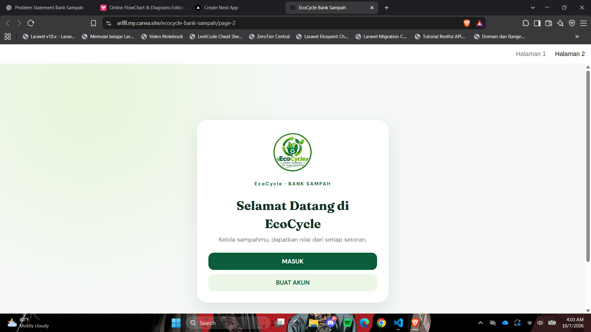
- 
- 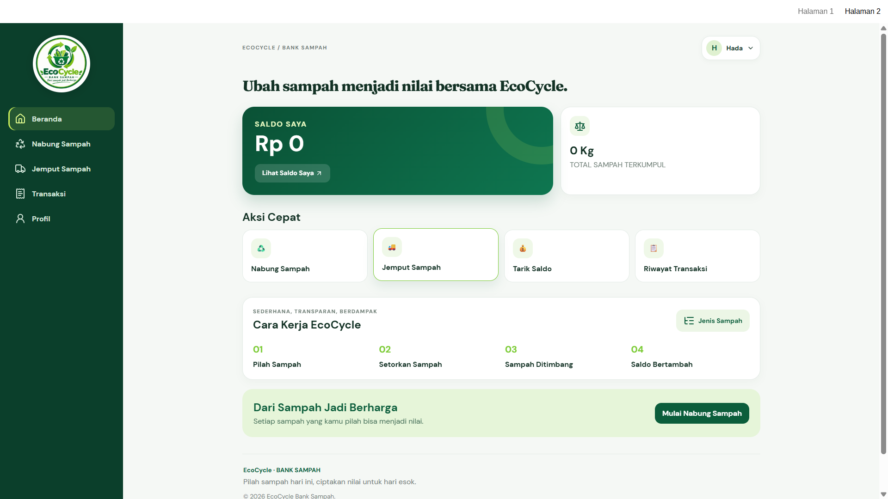
- 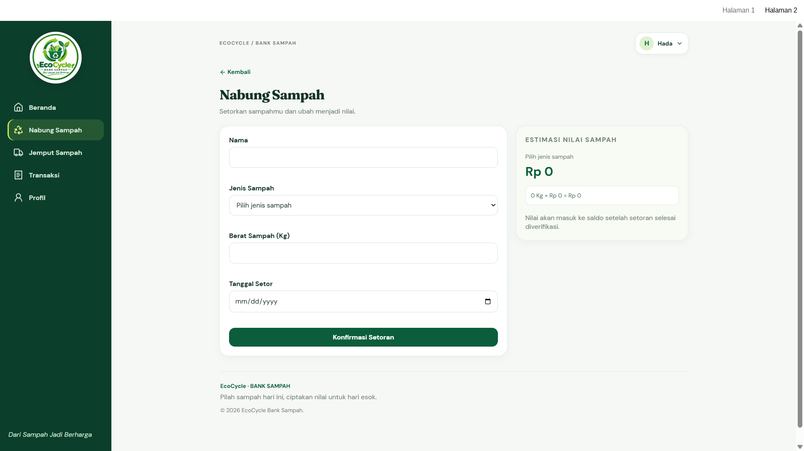
- 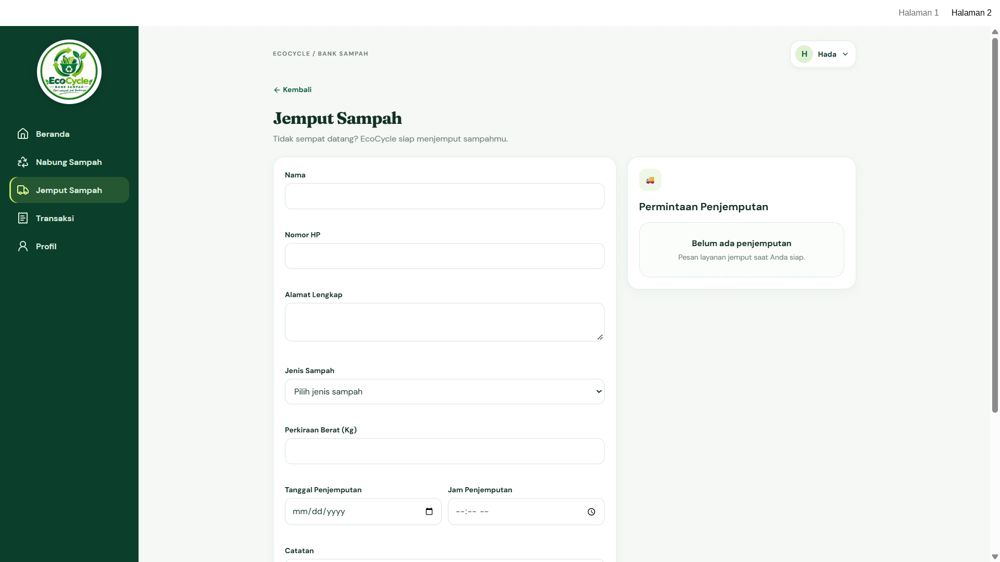
- 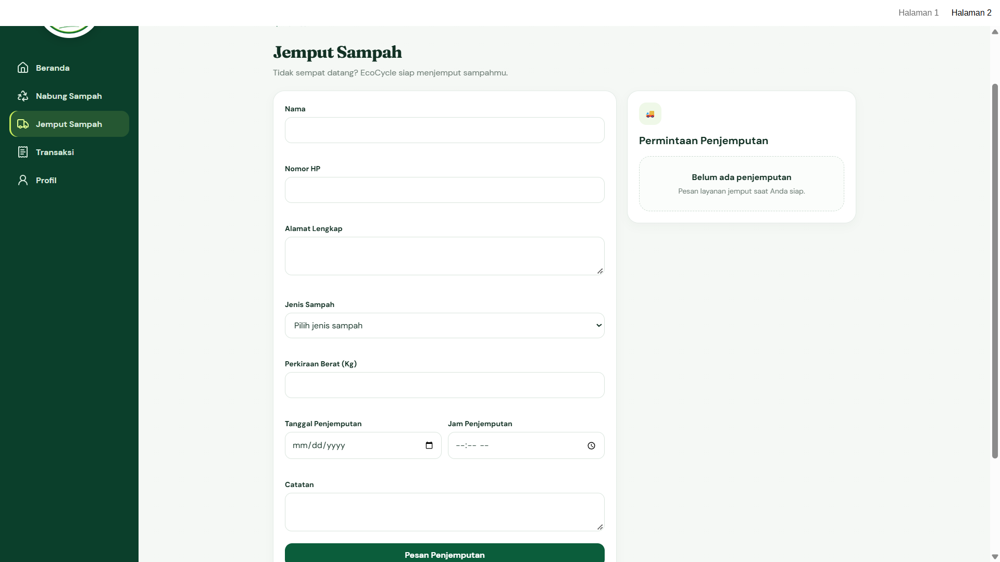
- 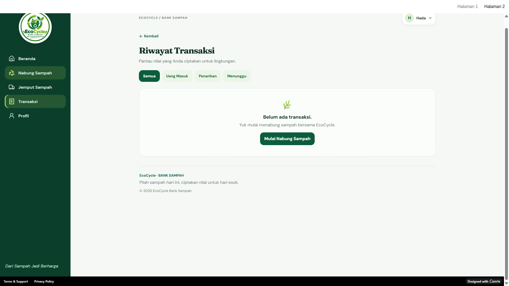
- 
- 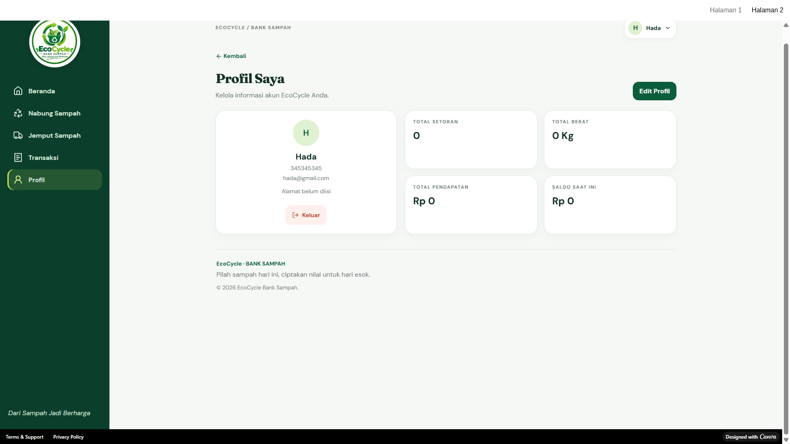
- 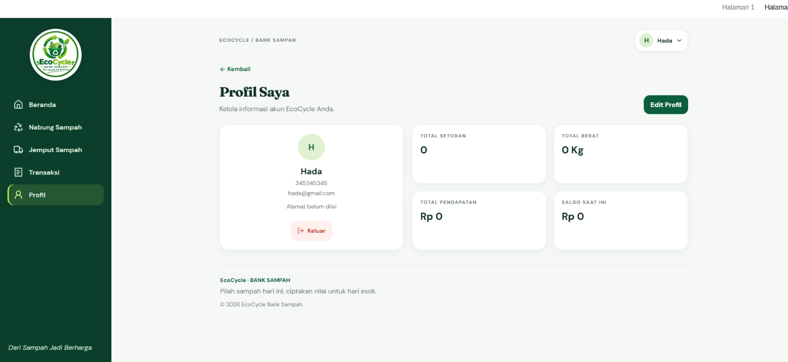
- 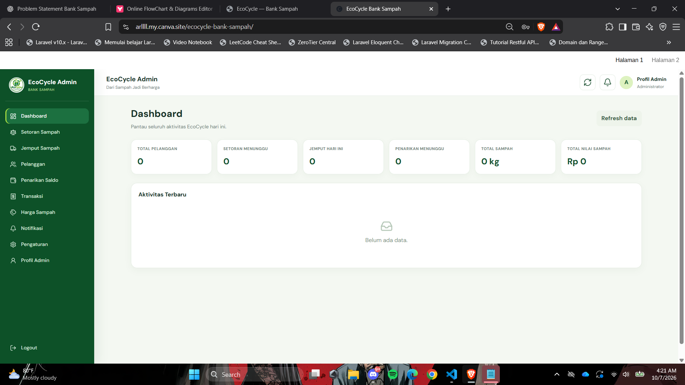
- 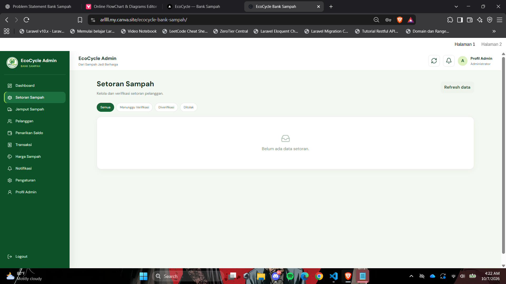
- 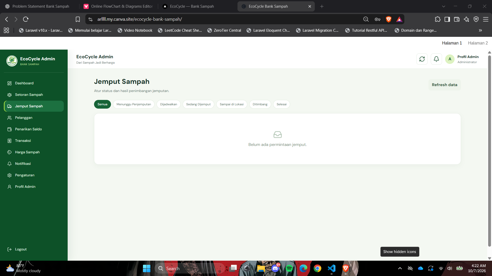
- 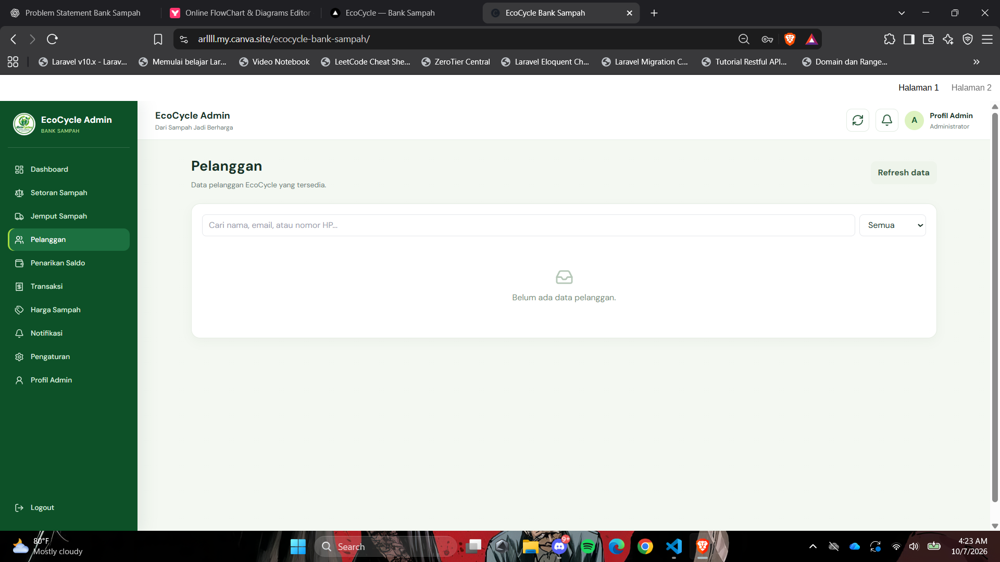
- 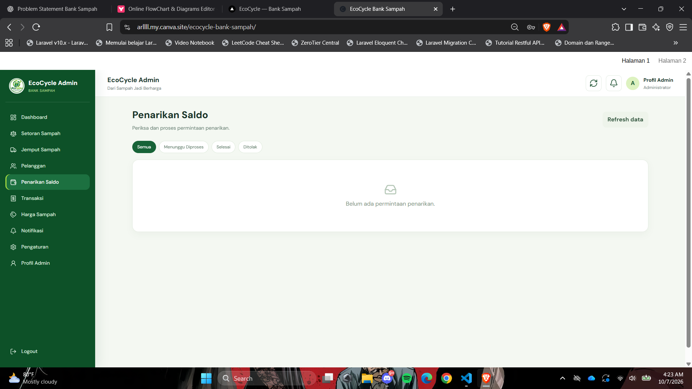
- 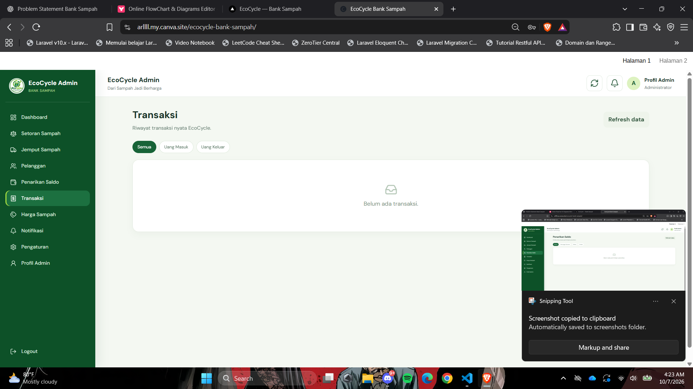
- 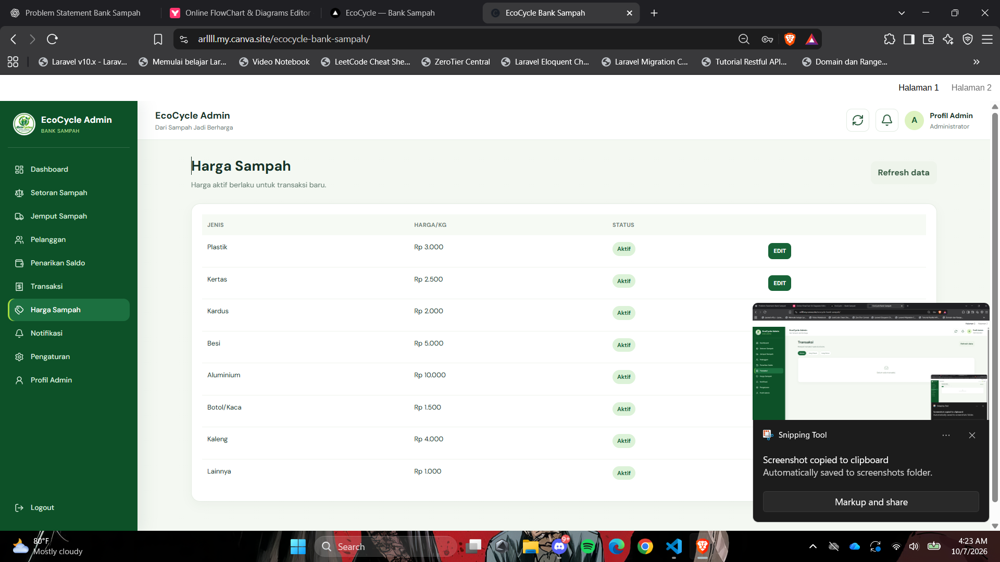
- 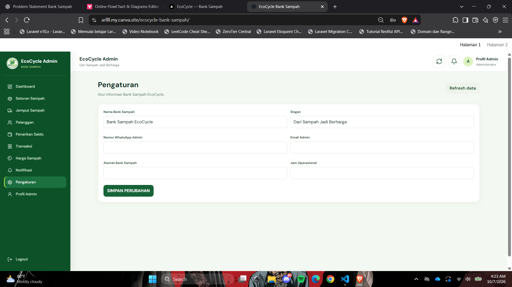
- 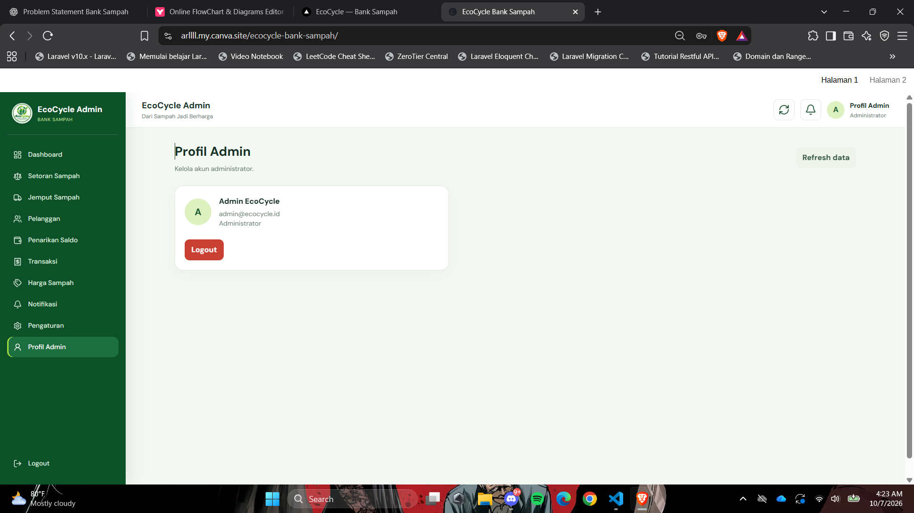
Dokumen dan lampiran yang belum tersedia akan ditambahkan selama proses desain dan pengembangan.