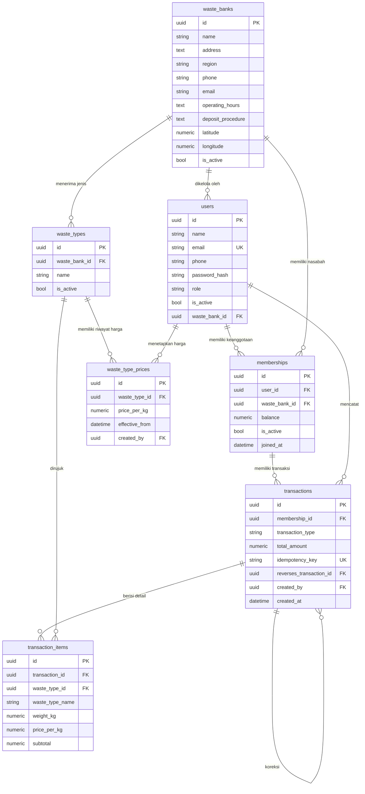

# ERD — EcoCycle

Dokumen ini menjelaskan struktur database EcoCycle: entitas, relasi, constraint, serta keputusan desain yang diambil.

Database: **MySQL 8.4**. Akses dilakukan melalui SQLAlchemy 2.0 dan skema dikelola dengan Alembic (`backend/migrations/`).

---

## Keputusan Desain

| # | Keputusan | Alasan |
|---|-----------|--------|
| 1 | Satu nasabah dapat memiliki keanggotaan di banyak bank sampah; **saldo disimpan per keanggotaan** dengan saldo awal Rp0. | PRD Open Questions; AC Task 3 "Saldo awal keanggotaan nasabah baru adalah Rp0". |
| 2 | Harga per kilogram disimpan sebagai **tabel riwayat harga** (`waste_type_prices`) yang berlaku sejak waktu tertentu; setiap transaksi menyimpan snapshot harga pada detailnya. | PRD ERD menyebut "jenis sampah" dan "harga" sebagai entitas terpisah; perubahan harga tidak boleh mengubah riwayat transaksi. |
| 3 | Pengelola terikat ke **satu bank sampah** melalui kolom `users.waste_bank_id`. | Task 6: administrator membuat akun pengelola dan menetapkan bank sampahnya. |

---

## Diagram



---

## Entitas

### users

Akun pengguna dengan peran `nasabah`, `pengelola`, atau `administrator`.

- `email` unik dan terindeks.
- `password_hash` menyimpan hasil hashing Argon2id (bukan kata sandi mentah).
- `role` disimpan sebagai `VARCHAR` + `CHECK`; pendaftaran umum hanya menghasilkan `nasabah`.
- `waste_bank_id` hanya diisi untuk pengelola; constraint `ck_users_pengelola_requires_waste_bank` mewajibkan pengelola memiliki bank sampah.

### waste_banks

Informasi bank sampah mitra yang dapat diakses publik.

- `name`, `address`, `region` wajib diisi.
- `latitude`/`longitude` mendukung tautan peta eksternal.
- `is_active` menonaktifkan bank tanpa menghapus data.
- Indeks pada `name` (pencarian nama) dan `region` (pencarian wilayah).

### memberships

Keanggotaan nasabah pada suatu bank sampah, tempat saldo disimpan.

- Unik pada kombinasi `(user_id, waste_bank_id)` — satu nasabah satu keanggotaan per bank.
- `balance` bertipe `DECIMAL(18, 2)` dengan default `0` dan `CHECK (balance >= 0)`.
- `joined_at` mencatat waktu keanggotaan dibuat.

### waste_types

Jenis sampah yang diterima oleh suatu bank sampah.

- Unik pada kombinasi `(waste_bank_id, name)` — nama jenis berbeda antar bank.
- `is_active` menonaktifkan jenis sampah agar tidak dipakai pada setoran baru, tanpa menghapus riwayat.

### waste_type_prices

Riwayat harga per kilogram per jenis sampah.

- Setiap perubahan harga menambah baris baru dengan `effective_from`.
- Harga aktif adalah baris dengan `effective_from` terbaru.
- `price_per_kg` bertipe `DECIMAL(12, 2)` dengan `CHECK (price_per_kg > 0)`.
- Indeks `(waste_type_id, effective_from)` mendukung pencarian harga aktif.

### transactions

Satu baris per setoran, penarikan, atau penyesuaian.

- `transaction_type`: `deposit`, `withdrawal`, atau `adjustment`.
- `total_amount` bertipe `DECIMAL(18, 2)`; deposit dan penarikan wajib positif (`adjustment` dapat bernilai negatif untuk koreksi).
- `idempotency_key` unik — request ulang dengan kunci sama tidak menghasilkan transaksi ganda.
- `created_by` wajib diisi (jejak audit petugas yang mencatat).
- `reverses_transaction_id` merujuk transaksi asal untuk koreksi; koreksi tidak menghapus riwayat.
- Indeks `(membership_id, created_at)` untuk riwayat nasabah dan `(created_at)` untuk laporan periode.

### transaction_items

Detail setoran per jenis sampah, memuat snapshot harga saat transaksi.

- `weight_kg` `DECIMAL(12, 3)` dengan `CHECK > 0`.
- `price_per_kg` dan `subtotal` `DECIMAL` — `price_per_kg` disalin dari harga yang berlaku saat setoran sehingga perubahan harga berikutnya tidak mengubah transaksi lama.
- `waste_type_name` disalin sebagai snapshot nama; jenis yang sudah dipakai transaksi tidak dapat dihapus (`ON DELETE RESTRICT`).

---

## Aturan Integritas

| Aturan | Mekanisme |
|--------|-----------|
| Uang dan berat memakai `NUMERIC`/`DECIMAL`, bukan floating-point | Tipe kolom `DECIMAL(18, 2)`, `DECIMAL(12, 2)`, `DECIMAL(12, 3)` |
| Saldo keanggotaan tidak negatif | `CHECK (balance >= 0)` |
| Saldo awal keanggotaan baru Rp0 | `DEFAULT 0` pada `memberships.balance` |
| Harga dan berat positif | `CHECK` pada `waste_type_prices`, `transaction_items` |
| Satu nasabah satu keanggotaan per bank | `UNIQUE (user_id, waste_bank_id)` |
| Jenis sampah unik per bank | `UNIQUE (waste_bank_id, name)` |
| Request ulang tidak menghasilkan transaksi ganda | `UNIQUE (idempotency_key)` |
| Transaksi tidak kehilangan keanggotaan/petugas | `ON DELETE RESTRICT` pada FK ke `memberships` dan `users` |
| Koreksi merujuk transaksi asal | `reverses_transaction_id` → `transactions.id` |
| Waktu disimpan dalam UTC | `DATETIME` dengan `DEFAULT CURRENT_TIMESTAMP`, server MySQL diatur `time_zone = +00:00` |

---

## Relasi dan Perilaku Hapus

| Relasi | ON DELETE | Catatan |
|--------|-----------|---------|
| `memberships.user_id` → `users.id` | CASCADE | Keanggotaan mengikuti pengguna. |
| `memberships.waste_bank_id` → `waste_banks.id` | RESTRICT | Bank dengan nasabah tidak dihapus; gunakan `is_active = false`. |
| `users.waste_bank_id` → `waste_banks.id` | RESTRICT | Pengelola melekat pada bank sampahnya. |
| `waste_types.waste_bank_id` → `waste_banks.id` | CASCADE | Jenis sampah mengikuti bank, kecuali sudah dipakai transaksi. |
| `waste_type_prices.waste_type_id` → `waste_types.id` | CASCADE | Riwayat harga mengikuti jenis sampah. |
| `transactions.membership_id` → `memberships.id` | RESTRICT | Riwayat transaksi terjaga. |
| `transaction_items.transaction_id` → `transactions.id` | CASCADE | Detail mengikuti transaksi induk. |
| `transaction_items.waste_type_id` → `waste_types.id` | RESTRICT | Jenis yang sudah tercatat tidak dihapus; nonaktifkan saja. |
| `transactions.reverses_transaction_id` → `transactions.id` | SET NULL | Referensi koreksi. |

---

## Migrasi

- Skema didefinisikan pada model SQLAlchemy di `backend/app/modules/*/models.py`.
- Migrasi dihasilkan Alembic di `backend/migrations/versions/`.
- Terapkan dengan perintah berikut dari `backend/`:

```bash
uv run alembic upgrade head
```

- Autogenerate untuk perubahan skema:

```bash
uv run alembic revision --autogenerate -m "deskripsi perubahan"
```
